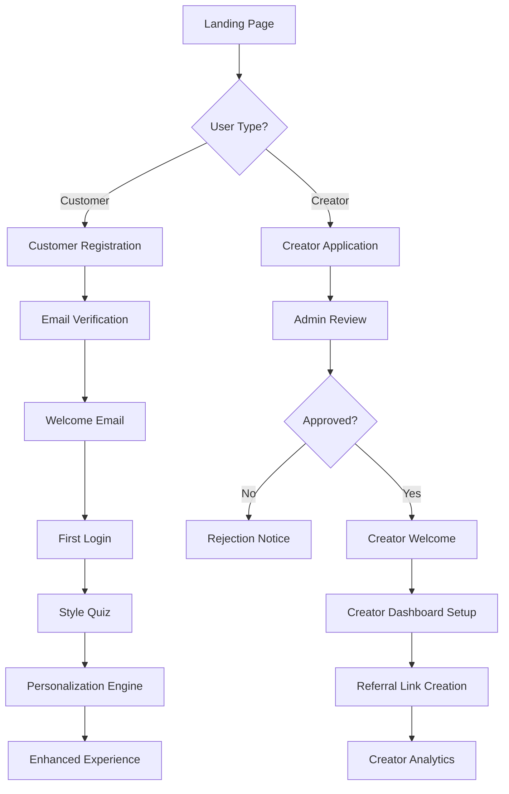

# User Onboarding Feature - Complete Technical Documentation

> **Document Version:** 1.0  
> **Last Updated:** December 19, 2024  
> **Status:** Production Ready  
> **Scope:** User registration, email verification, welcome flow, creator onboarding, and personalization setup

---

## 📋 Table of Contents

1. [Overview](#overview)
2. [Architecture & Flow](#architecture--flow)
3. [Registration System](#registration-system)
4. [Email Verification Flow](#email-verification-flow)
5. [Welcome Experience](#welcome-experience)
6. [Style Quiz Onboarding](#style-quiz-onboarding)
7. [Creator Program Onboarding](#creator-program-onboarding)
8. [AI-Powered Personalization](#ai-powered-personalization)
9. [API Endpoints](#api-endpoints)
10. [Database Schema](#database-schema)
11. [Email Templates](#email-templates)
12. [Security & Rate Limiting](#security--rate-limiting)
13. [Performance Metrics](#performance-metrics)
14. [Future Enhancements](#future-enhancements)

---

## 🌟 Overview

The GlowGlitch user onboarding system provides a comprehensive multi-step journey designed to convert visitors into engaged customers while establishing personalized preferences for optimal shopping experiences. The system supports both customer and creator onboarding workflows with sophisticated AI-driven personalization.

### **Core Objectives**

- **Seamless Registration**: Streamlined signup with email verification
- **Progressive Profiling**: Gradual collection of user preferences without friction
- **Immediate Value**: Instant access to core features with optional enhancements
- **Personalization**: AI-driven style matching and content adaptation
- **Creator Enablement**: Specialized onboarding for content creators and influencers

### **Key Features**

- **Multi-Role Support**: Customer, Creator, and Admin registration paths
- **Email Verification**: Secure account activation with welcome automation
- **Style Assessment**: Interactive quiz for jewelry preference mapping
- **AI Personalization**: Predictive morphing based on user behavior
- **Creator Program**: Comprehensive influencer onboarding with commission setup
- **Progress Tracking**: Visual indicators and completion incentives

---

## 🏗️ Architecture & Flow

### **Overall Onboarding Journey**



### **Technical Stack**

- **Frontend**: Next.js 14 with React components
- **Backend**: API routes with NextAuth.js integration
- **Database**: MongoDB with Mongoose schemas
- **Email**: Nodemailer with template system
- **Security**: bcrypt, JWT tokens, rate limiting
- **AI/ML**: Predictive morphing engine for personalization

---

## 🔐 Registration System

### **Customer Registration Flow**

**Location**: `src/app/api/auth/register/route.ts`

**Process Overview**:
1. Form validation using Zod schemas
2. Password strength enforcement
3. Duplicate email checking
4. User creation with hashed password
5. Email verification token generation
6. Welcome email dispatch

**Registration Schema**:
```typescript
const RegisterSchema = z.object({
  email: z.string().email('Invalid email address'),
  password: z.string()
    .min(8, 'Password must be at least 8 characters')
    .regex(/^(?=.*[a-z])(?=.*[A-Z])(?=.*\d)(?=.*[@$!%*?&])/, 
           'Password must contain uppercase, lowercase, number and special character'),
  firstName: z.string().min(1, 'First name is required').max(50),
  lastName: z.string().min(1, 'Last name is required').max(50),
  acceptTerms: z.boolean().refine(val => val === true, 'Must accept terms'),
  acceptMarketing: z.boolean().optional(),
  referralCode: z.string().regex(/^[A-Z0-9]{6,12}$/).optional()
})
```

**Security Features**:
- Rate limiting: 5 registrations per minute per IP
- Password complexity requirements
- Email uniqueness validation
- GDPR consent tracking with IP logging
- Referral code validation

**Response Structure**:
```json
{
  "success": true,
  "data": {
    "message": "Registration successful. Please check your email to verify your account.",
    "email": "user@example.com",
    "emailVerificationRequired": true
  },
  "meta": {
    "timestamp": "2024-12-19T10:30:00Z",
    "requestId": "req_123456",
    "version": "1.0"
  }
}
```

---

## ✉️ Email Verification Flow

### **Verification Process**

**Location**: `src/app/api/auth/verify-email/route.ts`

**Email Verification Steps**:
1. User clicks verification link from email
2. Token validation and expiration check
3. Account status update to 'active'
4. Welcome email with onboarding guidance
5. Auto-redirect to personalization flow

**Token Security**:
- Cryptographically secure random tokens
- 24-hour expiration for security
- Single-use verification
- Rate limiting: 10 attempts per minute per IP

**Next Steps Provided**:
```json
{
  "nextSteps": [
    "Complete your profile to personalize your experience",
    "Browse our collection of lab-grown jewelry", 
    "Use our 3D customizer to design unique pieces",
    "Join our creator program for exclusive benefits"
  ]
}
```

---

## 🎉 Welcome Experience

### **Welcome Email Content**

**Location**: `src/lib/email-service.ts` (lines 336-412)

**Welcome Email Features**:
- Personalized greeting with user's first name
- Clear next steps for engagement
- Special offer: WELCOME10 (10% off first order)
- Direct links to key features:
  - 🎨 3D Customizer
  - 💎 Product Catalog
  - 🌟 Creator Program
- Support contact information

**Email Template Structure**:
```html
<h1>Welcome to GlowGlitch, ${firstName}!</h1>
<p>Your email has been verified and your account is now active...</p>

<div style="margin: 30px 0;">
  <div style="display: inline-block; width: 100%; margin-bottom: 20px;">
    <h3 style="color: #d4af37;">🎨 Design Your Own Jewelry</h3>
    <p>Use our 3D customizer to create unique pieces tailored to your style.</p>
  </div>
  <!-- Additional features... -->
</div>

<div style="text-align: center;">
  <a href="${BASE_URL}/catalog" class="button">Start Shopping</a>
</div>

<div class="highlight">
  <strong>Special Offer:</strong> Use code <strong>WELCOME10</strong> for 10% off!
</div>
```

---

## 🎨 Style Quiz Onboarding

### **Interactive Style Assessment**

**Location**: `src/components/homepage/StyleQuizSection.tsx`

**Quiz Architecture**:
- Progressive question flow with save/resume capability
- Personality type calculation algorithm
- Visual progress indicators
- Social sharing capabilities
- Local storage for session persistence

**Quiz Data Structure**:
```typescript
interface QuizProgress {
  currentStep: number
  totalSteps: number
  answers: Record<string, string>
  startTime: number
}

interface QuizResult {
  personalityType: {
    name: string
    description: string
  }
  completionTime: number
  confidenceScore: number
}
```

**Personality Types Supported**:
- **Romantic**: Find Your Forever Piece
- **Bold**: Make a Statement  
- **Minimalist**: Pure. Simple. Beautiful.
- **Vintage**: Timeless Heritage Collection
- **Elegant**: Sophisticated Luxury
- **Playful**: Express Your Unique Style

**Quiz Flow Management**:
```typescript
const handleAnswer = (questionId: string, answerId: string) => {
  const newAnswers = { ...progress.answers }
  newAnswers[questionId] = answerId
  setProgress(prev => ({ ...prev, answers: newAnswers }))
}

const completeQuiz = async () => {
  const calculatedResult = calculatePersonalityType(progress.answers, progress.startTime)
  setResult(calculatedResult)
  QuizStorageService.clear()
  onQuizComplete?.(calculatedResult)
}
```

---

## 🎭 Creator Program Onboarding

### **Creator Application Process**

**Location**: `src/app/api/creators/apply/route.ts`

**Application Schema**:
```typescript
const creatorApplicationSchema = z.object({
  displayName: z.string().min(2).max(50),
  email: z.string().email(),
  bio: z.string().max(500).optional(),
  socialLinks: z.object({
    instagram: z.string().optional(),
    tiktok: z.string().optional(),
    youtube: z.string().optional(),
    twitter: z.string().optional(),
    website: z.string().url().optional()
  }).optional(),
  paymentInfo: z.object({
    method: z.enum(['paypal', 'bank', 'stripe']),
    details: z.string().min(1)
  }),
  requestedCommissionRate: z.number().min(0).max(50).default(10),
  audience: z.object({
    size: z.string(),
    demographics: z.string(),
    engagement: z.string()
  }).optional(),
  agreedToTerms: z.boolean().refine(val => val === true)
})
```

**Auto-Approval Logic**:
```typescript
// Auto-qualification check
let autoApproved = false
if (audience?.size && parseInt(audience.size) > 1000) {
  autoApproved = true
}
```

### **Creator Dashboard Setup**

**Location**: `Docs/creator-program/CREATOR_WORKFLOW_GUIDELINES.md` (lines 219-267)

**Initial Dashboard Interface**:
```
┌─────────────────────────────────────────────────────────────┐
│ 🎉 Welcome Emma! Your creator account is APPROVED           │
│ Creator Code: EMMA2024 | Commission Rate: 15% | Min: $50   │
├─────────────────────────────────────────────────────────────┤
│ Quick Setup (3 steps remaining):                           │
│ ✅ Profile completed                                        │
│ ⏳ Create your first referral link                         │
│ ⏳ Add payment method                                       │
│ ⏳ Share your first post                                    │
│                                                             │
│ Current Stats:                                              │
│ • Total Clicks: 0                                          │
│ • Total Sales: $0                                          │
│ • Pending Commission: $0.00                                │
│ • Conversion Rate: 0%                                       │
└─────────────────────────────────────────────────────────────┘
```

**Creator Onboarding Steps**:
1. **Approval Notification**: Welcome email with dashboard access
2. **Profile Setup**: Complete creator profile information
3. **First Link Creation**: Generate initial referral link
4. **Payment Configuration**: Set up commission payment method
5. **Content Guidance**: Share first promotional post

---

## 🤖 AI-Powered Personalization

### **Predictive Morphing Engine**

**Location**: `src/components/ai/PredictiveMorphing.tsx`

**User Profile Structure**:
```typescript
interface UserProfile {
  emotionalProfile: 'romantic' | 'bold' | 'minimalist' | 'vintage' | 'elegant' | 'playful'
  preferences: {
    colors: string[]
    materials: string[]
    styles: string[]
  }
  behaviorPattern: {
    browsingTime: number
    clickPatterns: string[]
    scrollVelocity: number
    interactionFrequency: number
  }
  currentMood: 'exploring' | 'deciding' | 'researching' | 'impulse' | 'gifting'
  confidenceLevel: number
}
```

**Behavioral Analysis Algorithm**:
```typescript
const analyzeBehaviorPattern = (profile: UserProfile): Partial<MorphingState> => {
  const { behaviorPattern, currentMood, emotionalProfile } = profile
  
  // Analyze interaction patterns
  let animationIntensity = 1
  if (behaviorPattern.interactionFrequency > 0.8) {
    animationIntensity = 1.3 // High engagement = more animations
  } else if (behaviorPattern.interactionFrequency < 0.3) {
    animationIntensity = 0.7 // Low engagement = subtle animations
  }
  
  // Mood-based layout adjustments
  let cardSize: 'compact' | 'standard' | 'featured' = 'standard'
  if (currentMood === 'impulse') {
    cardSize = 'featured' // Highlight products for impulse buyers
  } else if (currentMood === 'researching') {
    cardSize = 'compact' // More info density for researchers
  }
  
  return {
    layoutPreferences: { cardSize, gridDensity: currentMood === 'researching' ? 4 : 3, animationIntensity },
    personalizedContent: {
      suggestedProducts: [],
      prioritizedCategories: profileConfig.preferredCategories,
      customizedCopy: PERSONALIZED_COPY[emotionalProfile]
    }
  }
}
```

**Personalized Copy Examples**:
- **Romantic**: "Find Your Forever Piece" / "Discover Love"
- **Bold**: "Make a Statement" / "Own Your Style"
- **Minimalist**: "Pure. Simple. Beautiful." / "Embrace Simplicity"

---

## 🔌 API Endpoints

### **Authentication Endpoints**

| Method | Endpoint | Purpose | Rate Limit |
|--------|----------|---------|------------|
| `POST` | `/api/auth/register` | User registration | 5/min per IP |
| `POST` | `/api/auth/verify-email` | Email verification | 10/min per IP |
| `GET` | `/api/auth/verify-email?token=xyz` | Email link verification | 10/min per IP |
| `POST` | `/api/auth/login` | User authentication | 10/min per IP |
| `GET` | `/api/auth/session` | Session validation | 100/min per IP |

### **Creator Program Endpoints**

| Method | Endpoint | Purpose | Rate Limit |
|--------|----------|---------|------------|
| `POST` | `/api/creators/apply` | Creator application | 5/min per IP |
| `GET` | `/api/creators/apply?email=x` | Application status check | 20/min per IP |

### **User Profile Endpoints**

| Method | Endpoint | Purpose | Authentication |
|--------|----------|---------|----------------|
| `PUT` | `/api/user/profile` | Update user profile | Required |
| `POST` | `/api/user/addresses` | Add user address | Required |
| `PUT` | `/api/user/addresses/{id}` | Update address | Required |

---

## 🗄️ Database Schema

### **User Collection Structure**

```typescript
interface User {
  _id: string
  email: string
  emailVerified: boolean
  emailVerificationToken?: string
  emailVerificationExpires?: Date
  
  // Profile information
  firstName?: string
  lastName?: string
  displayName?: string
  dateOfBirth?: Date
  phone?: string
  profileImage?: string
  
  // Authentication
  password?: string // Hashed
  providers: AuthProvider[]
  
  // Account management
  role: 'customer' | 'creator' | 'admin'
  status: 'active' | 'inactive' | 'suspended' | 'pending-verification'
  
  // Preferences and personalization
  addresses: UserAddress[]
  preferences: UserPreferences
  
  // Creator program (optional)
  creatorProfile?: CreatorProfile
  
  // GDPR compliance
  gdprConsent: {
    accepted: boolean
    acceptedAt: Date
    version: string
    ipAddress: string
  }
  
  // Timestamps
  createdAt: Date
  updatedAt: Date
  lastActiveAt: Date
}
```

### **Creator Collection Structure**

```typescript
interface Creator {
  _id: string
  userId?: string // Linked after user account creation
  creatorCode: string // Unique identifier (e.g., "EMMA2024")
  displayName: string
  email: string
  bio?: string
  
  socialLinks: {
    instagram?: string
    tiktok?: string
    youtube?: string
    twitter?: string
    website?: string
  }
  
  paymentInfo: {
    method: 'paypal' | 'bank' | 'stripe'
    details: string // Encrypted
  }
  
  status: 'pending' | 'approved' | 'suspended' | 'inactive'
  commissionRate: number
  minimumPayout: number
  
  metrics: {
    totalClicks: number
    totalSales: number
    totalCommission: number
    conversionRate: number
  }
  
  createdAt: Date
  approvedAt?: Date
}
```

---

## 📧 Email Templates

### **Template System Architecture**

**Location**: `src/lib/email-service.ts`

**Available Templates**:
1. **Email Verification**: Secure account activation
2. **Welcome Email**: Post-verification onboarding
3. **Creator Approval**: Creator program acceptance
4. **Creator Rejection**: Application denial with feedback

**Template Configuration**:
```typescript
const emailConfig = {
  FROM_NAME: 'GlowGlitch',
  FROM_EMAIL: process.env.SMTP_FROM,
  SUPPORT_EMAIL: process.env.SUPPORT_EMAIL,
  BASE_URL: process.env.NEXTAUTH_URL
}
```

**Template Features**:
- Responsive HTML design
- Plain text fallbacks
- Dynamic content insertion
- Call-to-action buttons
- Branded styling with Aurora Design System compliance

---

## 🛡️ Security & Rate Limiting

### **Security Measures**

**Password Security**:
- bcrypt hashing with salt rounds = 12
- Complexity requirements: uppercase, lowercase, number, special character
- Minimum 8 characters length

**Rate Limiting Configuration**:
```typescript
const RATE_LIMIT_CONFIGS = {
  REGISTER: { limit: 5, windowMs: 60000 }, // 5 per minute
  VERIFY_EMAIL: { limit: 10, windowMs: 60000 }, // 10 per minute
  LOGIN: { limit: 10, windowMs: 60000 }, // 10 per minute
  CREATOR_APPLY: { limit: 5, windowMs: 60000 } // 5 per minute
}
```

**Token Security**:
- Email verification tokens: 24-hour expiration
- JWT tokens: Secure payload with user context
- Single-use verification links
- CSRF protection on state-changing operations

**Data Protection**:
- GDPR consent tracking with IP logging
- Personal data encryption for sensitive fields
- Secure password reset with time-limited tokens
- User data export and deletion capabilities

---

## 📊 Performance Metrics

### **Onboarding Funnel Analytics**

**Key Performance Indicators**:
- **Registration Conversion**: Landing → Registration form completion
- **Email Verification Rate**: Registration → Email verification completion
- **Onboarding Completion**: Verification → Style quiz completion
- **First Purchase Rate**: Quiz completion → First order within 30 days
- **Creator Application Rate**: Visitor → Creator application submission

**Performance Targets**:
- Registration form completion: >60%
- Email verification completion: >80%
- Style quiz completion: >45%
- First purchase conversion: >15%
- Creator application approval: >70%

**Technical Performance**:
- Registration API response time: <300ms
- Email delivery: <2 seconds
- Page load times: <2 seconds
- Mobile responsiveness: 90+ Lighthouse score

---

## 🚀 Future Enhancements

### **Planned Features**

**Progressive Web App (PWA)**:
- Offline onboarding capability
- Push notifications for incomplete flows
- App-like installation experience

**Advanced Personalization**:
- Machine learning recommendation engine
- Behavioral prediction algorithms
- Dynamic pricing based on user segments
- A/B testing framework for onboarding flows

**Social Integration**:
- Social media login options (Google, Apple, Facebook)
- Friend referral system with incentives
- Social proof integration in onboarding
- Viral sharing mechanics for quiz results

**Creator Program Expansion**:
- Multi-tier commission structure
- Advanced analytics dashboard
- Creator collaboration tools
- Automated content suggestion system

**Accessibility Improvements**:
- Screen reader optimization
- Keyboard navigation support
- High contrast mode
- Multiple language support

### **Technical Debt & Improvements**

**Code Organization**:
- Extract onboarding components into dedicated module
- Implement comprehensive TypeScript interfaces
- Add unit test coverage for critical flows
- Optimize bundle size for mobile performance

**Database Optimization**:
- Implement user preference caching
- Add database indexes for query performance
- Set up automated backup systems
- Create data retention policies

**Monitoring & Analytics**:
- Implement error tracking with Sentry
- Add performance monitoring
- Create onboarding funnel dashboards
- Set up automated alerts for conversion drops

---

## 🎯 Conclusion

The GlowGlitch user onboarding system represents a comprehensive approach to user acquisition and engagement, combining modern web technologies with AI-driven personalization. The system successfully balances user experience optimization with security requirements while providing clear pathways for both customer and creator journeys.

The architecture supports scalable growth with robust rate limiting, comprehensive error handling, and detailed analytics tracking. Future enhancements will focus on machine learning integration, progressive web app capabilities, and expanded creator program functionality.

**Key Success Factors**:
- Minimal friction registration process
- Immediate value delivery through personalization
- Clear progress indicators and completion incentives
- Robust security with GDPR compliance
- Comprehensive creator program integration

This documentation serves as the technical foundation for ongoing development and optimization of the user onboarding experience, ensuring consistent implementation across all team members and stakeholders.
